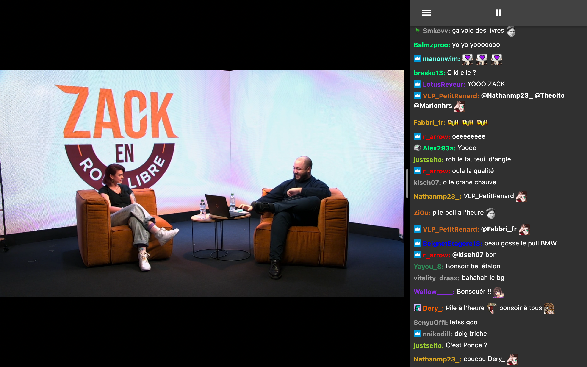
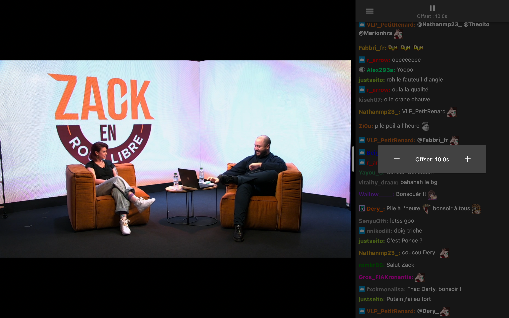

# Twplay

Twplay allows you to watch a Twitch VOD while displaying the chat in sync.

## Features

- BTTV and 7TV Emotes
- Chromecast
- Sync offset between player and chat

## Examples




## Dependencies

- Python 3.9+
- Java 1.8+
- [Flutter SDK](https://docs.flutter.dev/development/tools/sdk/releases)
- [mpv](https://mpv.io/installation/)
- [Docker Desktop](https://www.docker.com/products/docker-desktop/)
- [Twitch CLI](https://dev.twitch.tv/docs/cli/)
- [TwitchDownloaderCLI](https://github.com/lay295/TwitchDownloader#cli)
- [TwitchRecover](https://github.com/n18abdel/TwitchRecover/releases/tag/v1.0.0)

## Installation

**THIS WAS TESTED ONLY ON MAC OS**

For other platforms, some changes might be needed in this [file](twitch_VOD_player/controller.py) (especially subprocess commands).

### TwitchRecover dependency

Follow the instructions [here](twitch_VOD_player/twitch_url_retriever/README.md#twitchrecover-dependency).

### Chat renderer

```bash
cd twitch_chat_render/
flutter config --enable-macos-desktop
flutter build macos
cp -r build/macos/Build/Products/Release/twitch_chat_render.app /Applications
```

For other platforms, more information [here](https://docs.flutter.dev/desktop#build-a-release-app).

### twplay

```bash
pip3 install .
```

## Basic usage

```bash
twplay https://www.twitch.tv/videos/<vod_id>
```

A MPV window should open, with a chat render window. You just need to position them side by side, and then you can start the playback.

- Twitchtracker (may not work)

```bash
twplay https://twitchtracker.com/<streamer_name>/streams/<stream_id>
```

- Chromecast

```bash
twplay https://www.twitch.tv/videos/<vod_id> --cast
```

**THIS CAST ON A NVIDIA SHIELD BY DEFAULT**

For other devices, you should change the CAST_NAME [here](twitch_VOD_player/chromecast_player.py#L14) before installation.

- Help

```bash
twplay --help
```

## Thanks

I would like to thank [Lewis Pardo](https://github.com/lay295) for making [TwitchDownloaderCLI](https://github.com/TwitchRecover/TwitchRecover), and inspiring me to do this project !
